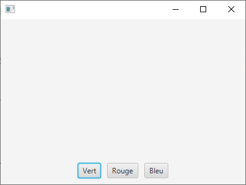

#  
# Introduction aux interfaces homme-machine (IHM) 

### IUT Montpellier-Sète – Département Informatique

* **Cours:** [M2105](http://cache.media.enseignementsup-recherche.gouv.fr/file/25/09/7/PPN_INFORMATIQUE_256097.pdf) - Le support de cours est [consultable ici](https://iutinfomontp-m2105.github.io/Cours).
* **Enseignants:** [Kevin Chapuis](mailto:kevin.chapuis@umontpellier.fr), [Sophie Nabitz](mailto:sophie.nabitz@univ-avignon.fr), [Rémy Portier](mailto:remyportier34@gmail.com)
* Le [forum Piazza]((https://piazza.com/class/kopinpctu3p678) de ce cours pour poser vos questions
* [Email](mailto:sophie.nabitz@univ-avignon.fr) pour une question d'ordre privée concernant le cours.

## TP 1 : Premiers pas avec JavaFX

Plusieurs exercices de ce TP sont repris (et/ou adaptés) de ceux rédigés par Sébastien NEDJAR pour l'IUT d'Aix-en-Provence, merci à lui de me permettre de les utiliser.

### Création de votre fork du TP

Comme pour les TP du module "Bases de la Programmation Orientée Objet", vous devrez ici aussi, pour chaque TP de ce module, créer votre fork en cliquant sur un lien classroom. Pour le TP1, utilisez le lien suivant :

[https://classroom.github.com/a/YEOYpo_w](https://classroom.github.com/a/YEOYpo_w) 

Une fois votre fork créé, vous le clonerez classiquement dans IntelliJ.

Tout au long du TP, vous pouvez avoir besoin de **consulter les pages de documentation** de JavaFX, qui sont [disponibles ici](https://openjfx.io/javadoc/16/).

### Exercice 1 - Contrôles de base

Pour commencer simplement, nous allons construire une petite application graphique qui correspond au *"Bonjour à tous"* traditionnel...<br/>
A la fin de chaque question, vous ferez exécuter votre nouvelle version de l'application. Pensez aussi à committer (et pousser) régulièrement.

1 - Lisez le contenu du fichier `MaFirstJavaFXWindow.java` et faites-le exécuter. Modifiez le titre de la fenêtre en *"Hello Application"* et fixez les largeur et hauteur à 400 (`setWidth` et `setHeight`).

2 - Dans la méthode `start`, instanciez un conteneur `VBox`, et précisez que les éléments qu'il contiendra seront centrés (en utilisant sa méthode `setAlignment`). Vous y ajouterez un `Label` dont le texte actuel est *"Bonjour à tous !"*.
Déclarez ensuite une scène dans laquelle vous placerez votre conteneur, et ajoutez cette scène à votre fenêtre principale (objet de la classe `Stage`).

3 - Ajoutez maintenant un `TextField` qui permettra de saisir un nom, et fixez-en la largeur maximale (`setMaxWidth`) à 150. Puis ajoutez un `Button` construit avec le texte *"Dire bonjour"*.

4 - On va maintenant ajouter l'écouteur sur ce bouton, dans un premier temps sous la forme d'une lambda (```event -> { ... }```). Une action sur ce bouton aura pour effet de transformer le texte du Label en *"Bonjour à toi, César"*, quand *César* a été saisi dans le `TextField`.

5 - Transformez ensuite l'expression lambda en un attribut `final` de la classe, de type `EventHandler<ActionEvent>` ; vous serez amener à déplacer vos composants, qui deviennent maintenant des attributs de la classe.

6 - Vous allez maintenant faire un peu de mise en forme...<br/>
Remplacez le texte du bouton par une image : pour cela, déclarez un objet de la classe `ImageView` construit avec cette URL<ul>
 [https://raw.githubusercontent.com/IUTInfoMontp-M2103/ProjetBang/master/ressources/logo.jpeg](https://raw.githubusercontent.com/IUTInfoMontp-M2103/ProjetBang/master/ressources/logo.jpeg) </ul>
et utilisez la méthode `setGraphic` sur le bouton.<br/>
Changez la fonte du `TextField` en Courier 15 (`Font.font("Courier", FontWeight.NORMAL, 15)`) et celle du `Label` en 30 et bold.<br/>
Essayez aussi de changer l'image du bouton en utilisant la ressource *"Bonjour.jpg"* qui vous est fournie dans le répertoire exercice1.<br/>
Enfin, utilisez le fichier *"Bonjour.css"* pour configurer la scène, en utilisant <ul> `scene.getStylesheets().add(getClass().getClassLoader().getResource("exercice1/Bonjour.css").toExternalForm());`.</ul>

### Exercice 2 - Conteneurs BorderPane et HBox

Vous devez écrire une application dont la fenêtre initiale est la suivante :<center>
</center>
Un clic sur un des boutons (ici 3 clics sur le vert) donnera le résultat suivant :<center>

</center>
Vous utiliserez pour cela un conteneur `BorderPane` (taille 400 sur 200), dont l'élément du haut est un `Label` centré, celui du milieu un `Pane` et celui du bas une `HBox` de `Button`. Le changement de couleur d'un panneau se fait en utilisant la méthode `setStyle`.

### Exercice 3 - Conteneur GridPane

Reproduisez la fenêtre suivante en utilisant un conteneur `GridPane`:<center>

</center>

Cette fenêtre est déplaçable, mais pas redimensionnable (`initStyle(StageStyle.UTILITY)`)
Les 9 éléments sont des `Label`, dont vous aurez défini les "graphiques" en utilisant les 3 fichiers qui sont fournis dans le répertoire resources\exercice3.<br/>L'image à afficher sera choisie aléatoirement ; pour cela, vous pouvez faire générer un nombre en 0 et 2, à partir d'un objet `Random`:<ul>
`Random random = new Random();`<br/>
`int nombre = random.nextInt(3);`</ul>

### Exercice 4 - Utilisation de FXML

Consultez les fichiers du package exercice4 : vous reconnaissez en partie le code du fichier `CounterMain.java`, qui définit la fenêtre principale, et dont la structure est chargée à partir du fichier ressource *"CounterView.fxml"* du répertoire *"resources/exercice4"*.<br/>
Le contenu de *"CounterView.fxml"* définit la racine de la scène comme un conteneur `BorderPane`, dont l'élément au centre un `VBox`. Ce dernier contient un `Label`et un conteneur `HBox`, lui même contenant 2 boutons.<br/>Le nom de chacun de ces éléments est donné par l'attribut `fx:id`.

Complétez le fichier `CounterController.java` en déclarant les attributs correspondant aux éléments du fichier *fxml* et annotez-les @FXML. Initialisez le texte du `Label` avec la chaîne *"0"*.

Ecrivez le code des deux méthodes `increment`et `decrement`, qui font varier la valeur de l'attribut counter, et modifient le texte du `Label`. Associez ces méthodes avec les éléments du fichier *fxml*, en ajoutant dans les balises appropriées les attributs `onAction="#increment"` et `onAction="#decrement"`.<br/>

Associez enfin les fichiers `CounterController.java` et `CounterView.fxml` en ajoutant dans la balise racine un attribut fx:controller de valeur le nom complet de la classe (c'est-à-dire en précisant aussi le package dans lequel elle est définie).

### Exercice 5 - Création de l'IHM en FXML et SceneBuilder

Constatez, dans le fichier `LoginControl.java`, que nous définissons ici un nouveau contrôle, basé sur un `GridPane`, et qui pourra donc être utilisé par la suite comme un nouveau composant en soi. C'est d'ailleurs ce qui est fait dans la classe `LoginMain`.

Utilisez le SceneBuilder pour construire la fenêtre suivante (la racine de la scène étant un conteneur `GridPane`), en complétant le fichier *fxml* donné :<center>

</center>

Le fichier *css* vous est fourni, il n'est pas nécessaire de le modifier. Vous l'associerez à votre contrôle en utilisant la possibilité du panneau Properties de la racine. 

La totalité de la classe `LoginMain` vous est fournie, et vous devez compléter la classe `LoginControl` en déclarant les variables d'instance manquantes (qui correspondent aux éléments du fichier *fxml*) et en implémentant les actions des deux boutons.<br/>
Un clic sur le bouton OK affiche sur la console le nom de l'utilisateur et une suite d'étoiles dont la longueur correspond au nombre de caractères du mot de passe, et un clic sur Cancel vide les deux champs.

### Exercice 6 - Animations

Regardez (et exécutez) le code fourni dans la classe `Animation`, et transformez-le pour que l'image fasse le tour de la fenêtre, puis revienne automatiquement en sens inverse.
